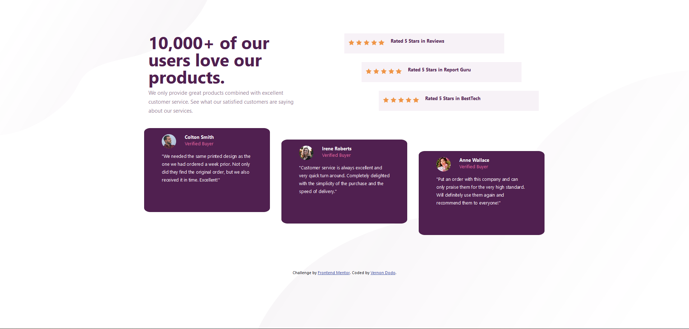

# Frontend Mentor - Social proof section solution

This is a solution to the [Social proof section challenge on Frontend Mentor](https://www.frontendmentor.io/challenges/social-proof-section-6e0qTv_bA). Frontend Mentor challenges help you improve your coding skills by building realistic projects.

## Table of contents

- [Overview](#overview)
  - [The challenge](#the-challenge)
  - [Screenshot](#screenshot)
  - [Links](#links)
- [My process](#my-process)
  - [Built with](#built-with)
  - [What I learned](#what-i-learned)
  - [Continued development](#continued-development)
  - [Useful resources](#useful-resources)
- [Author](#author)

## Overview

### The challenge

Users should be able to:

- View the optimal layout for the section depending on their device's screen size

### Screenshot

### Links

- Solution URL: (https://github.com/VernonDodo/social-proof-section)
- Live Site URL: (https://chic-froyo-6fe01a.netlify.app/)

## My process

I like to work with Bootstrap components and combine them with Flexbox because it automatically lends itself to site responsiveness, without having to code responsiveness into the site.

### Built with

- Semantic HTML5 markup
- CSS custom properties
- Flexbox

### What I learned

I am good now with working with components but I still have a long way to go with layout.

### Continued development

I need to work on layout and definitely need to change to a more mobile-first approach since mobile browsing exceeds web browsing. Along with a mobile-first approach, I need to work on responsiveness and working with tools and frameworks that lends itself to coding responsive apps.

### Useful resources

- [Flexbox Grid](http://flexboxgrid.com/) - This helped me with component layout
- [CSS Tricks](https://css-tricks.com/) - This is an incredible resource for everything pertaining to CSS

## Author

- Frontend Mentor - [@VernonDodo](https://www.frontendmentor.io/profile/VernonDodo)
